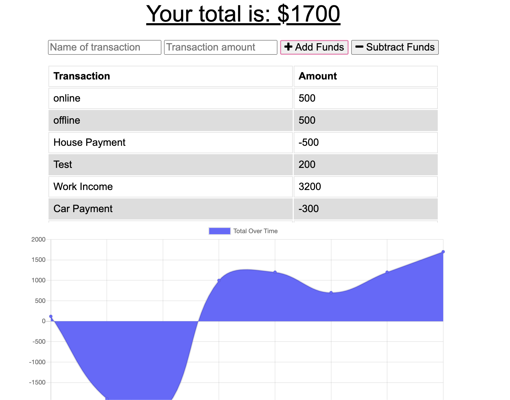

# Budget-Tracker

## Table of Contents
  - [Description](#description)
  - [Deployed Site](##DeployedSite)
  - [Installation](#installation)
  - [Usage](#usage)
  - [License](#license)

## Description
A Budget Tracker application that allows the user to be able to add expenses and deposits to their budget with or without a connection.

## Deployed Site
TBA

## Installation 
NPM Install - node, mongodb, express, mongoose, webpack

## Usage
Run "npm start" in the terminal

## License
MIT License
Copyright (c) [2020] [Monica Rangel]
## Questions
- Github: https://github.com/monicarangel95

